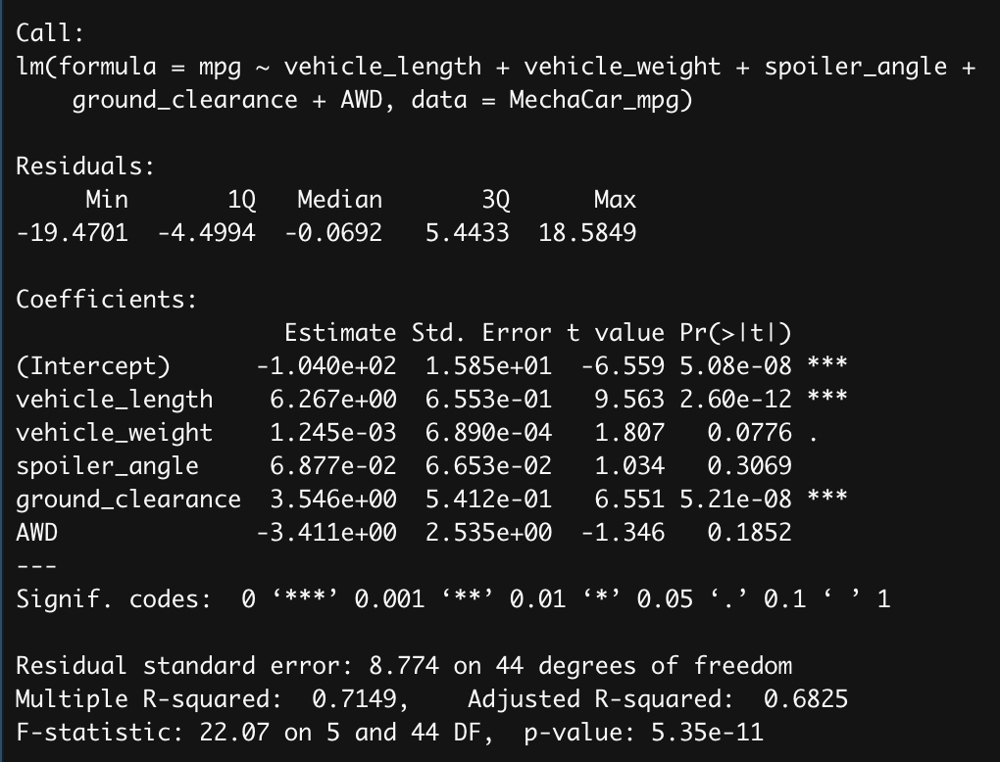
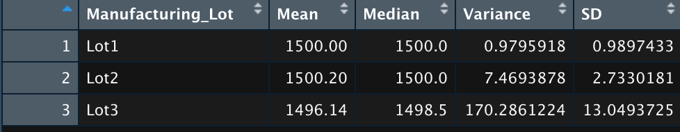
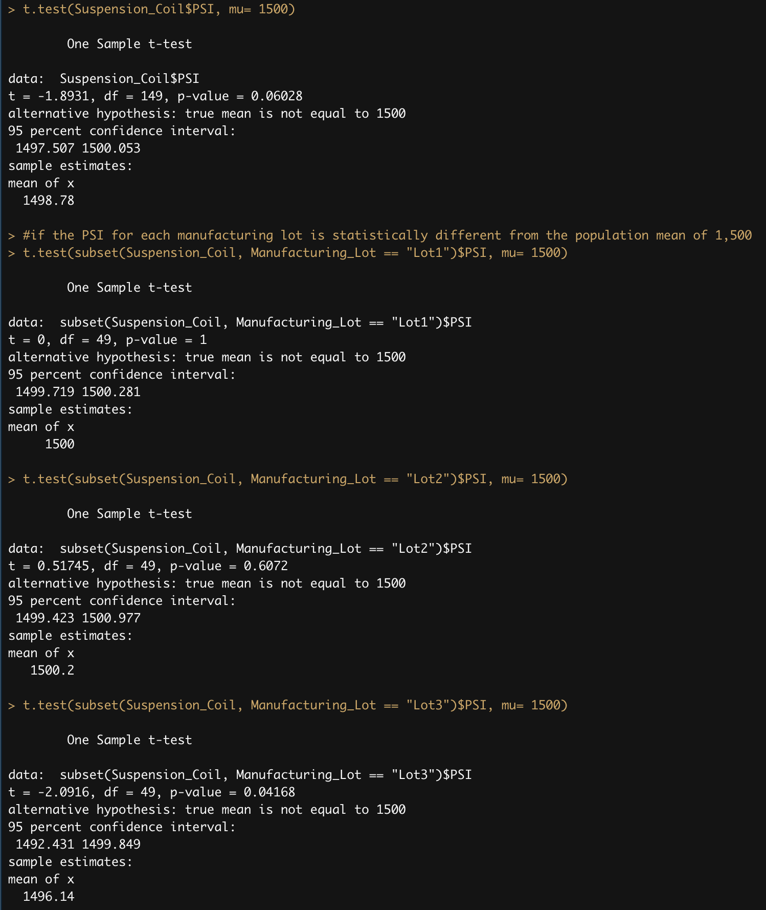

# MechaCar_Statistical_Analysis
## Linear Regression to Predict MPG
- MPG summary

- According to the MPG summary, the p-value for intercept, vehicle length, and ground clearance are less than 0, which indicate that they are statistically unlikely to provide random amounts of variance to the mpg values in the dataset.
- The slope of the linear model is not considered to be zero, because the p-value of our linear regression analysis is 5.35e-11. Since the p-value is much smaller than 0.05%, this indicates that there is sufficient evidence to reject the null hypothesis. 
- This linear model predicts mpg of MechaCar prototypes effectively because r-squared value is 0.71, which indicates that 71% of the data fit the linear model.

## Summary Statistics on Suspension Coils
- Total Summary

- Lot summary

- Accoriding to the total summary, the variance of the suspension coils for all manufacturing lots in total is 62.29, which does not exceed 100 pounds per square inch, thus it meets the design specification. However, as shown on the lot summary, the variance for lot 3 exceeds 100 pounds per square inch, thus the data does not meet the design specification for each lot individually.

## T-Tests on Suspension Coils
- T-Tests on suspension coils

- According to the first t-test on the picture, p-value is 0.06, which is the above the common 0.05%. Thus, it indicates that there is no sufficient evidence to reject the null hypothesis and the PSI across all manufacturing lots is statistically similar with the population mean of 1,500 pounds per square inch.
- According to the second t-test on the picture, p-value is 1, which indicates that the PSI for lot 1 is statistically similar with the population mean of 1,500 pounds per square inch.
- According to the third t-test on the picture, p-value is 0.61, which indicates that the PSI for lot 2 is statistically similar with the population mean of 1,500 pounds per square inch.
- According to the fourth t-test on the picture, p-value is 0.04, which indicates that the PSI for lot 3 is statistically different from the population mean of 1,500 pounds per square inch.

## Study Design: MechaCar vs Competition
- In order to quantify how the MechaCar performs against the competition, I would test MPG and safety rating.
- A null hypothesis: there is no statistical difference between the sample means of MPG and safety rating for the MechaCar and the sample means of MPG and safety rating for the competitor's vehicles.
- An alternative hypothesis: there is a statistical difference between the sample means of MPG and safety rating for the MechaCar and the sample means of MPG and safety rating for the competitor's vehicles.
- I would use the two-sample t-Test (one-tailed test) to see whether the sample means of MPG and safety rating for the MechaCar are greater than the sample means of MPG and safety rating for the competitor's vehicle. If the sample means for the MechaCar are greater than the sample means for the competitor's vehicles, it would indicate that the MechaCar outperforms the competitor.  
- I would need the data to show MPG and safety rating for the MechaCar and the data to show MPG and safety rating for the competitor's vehicles like MechaCar to run the statistical test.
